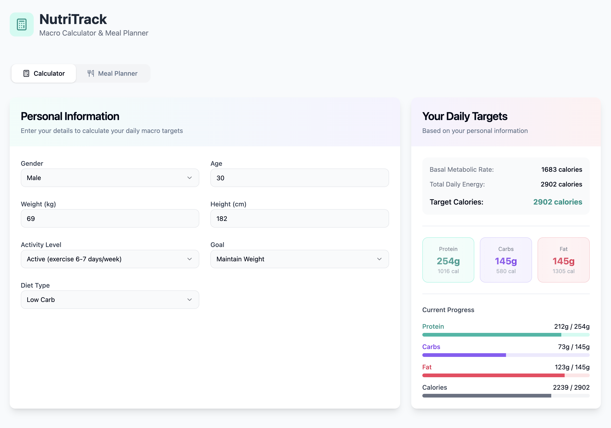

# NutriTrack - Macro Calculator & Meal Planner

NutriTrack is a modern, interactive web application built with Next.js that helps users calculate their macronutrient targets and plan their daily meals. The app provides a seamless user experience for tracking nutrition goals and creating personalized meal plans.



## Features

- **Personalized Macro Calculation**: Calculate your daily macronutrient needs based on:
  - Gender
  - Age
  - Weight
  - Height
  - Activity level
  - Fitness goal (lose, maintain, or gain weight)
  - Diet type preferences (balanced, low carb, low fat)

- **Interactive Meal Planner**:
  - Search and add foods from a comprehensive food database
  - Track protein, carbs, fat, and total calories
  - Edit portion sizes
  - Replace foods with alternatives
  - Visual progress indicators for daily macro goals

- **Automated Meal Plan Generation**:
  - Generate complete daily meal plans that match your macro targets
  - Meals balanced across breakfast, lunch, dinner, and snacks
  - Smart algorithm adjusts food combinations to meet specific macro ratios

- **User-Friendly Interface**:
  - Clean, modern design with visual progress indicators
  - Intuitive food search functionality
  - Responsive layout works on desktop and mobile devices

## Getting Started

### Prerequisites

- Node.js 18.0 or higher
- npm, yarn, pnpm, or bun

### Installation

1. Clone the repository:

   ```bash
   git clone https://github.com/your-username/macro-calculator.git
   cd macro-calculator
   ```

2. Install dependencies:

   ```bash
   npm install
   # or
   yarn
   # or
   pnpm install
   # or
   bun install
   ```

3. Run the development server:

   ```bash
   npm run dev
   # or
   yarn dev
   # or
   pnpm dev
   # or
   bun dev
   ```

4. Open [http://localhost:3000](http://localhost:3000) with your browser to see the application.

## How to Use

1. **Calculate Your Macros**:
   - Enter your personal information in the Calculator tab
   - Your BMR, TDEE, target calories, and macronutrients will be automatically calculated

2. **Add Foods to Your Meal Plan**:
   - Switch to the Meal Planner tab
   - Search for foods in the database or enter custom nutrition values
   - Specify portion size and select the meal to add it to

3. **Generate a Meal Plan**:
   - Click the "Generate Meal Plan" button for an AI-generated meal plan based on your targets
   - The system will create a balanced plan across all meals that meets your macro goals

4. **Customize Your Plan**:
   - Edit food portion sizes by clicking the edit icon
   - Replace foods with alternatives using the search feature
   - Remove foods you don't want with the delete button

5. **Track Your Progress**:
   - Visual progress bars show how close you are to reaching your daily targets
   - The Daily Totals section provides a summary of your current macros vs. targets

## Tech Stack

- **Framework**: [Next.js](https://nextjs.org/)
- **UI Components**: [shadcn/ui](https://ui.shadcn.com/)
- **Styling**: [Tailwind CSS](https://tailwindcss.com/)
- **Icons**: [Lucide Icons](https://lucide.dev/)

## License

This project is released under the MIT License - see the LICENSE file for details.

## Acknowledgments

- Food database compiled from various nutritional data sources
- UI design inspired by modern health and fitness applications

---

Built with ❤️ by F.
